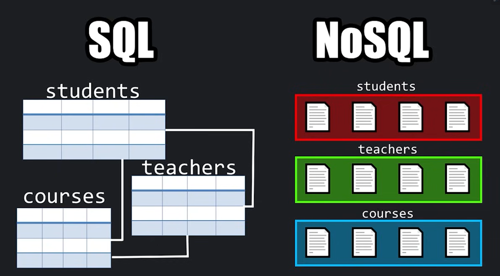
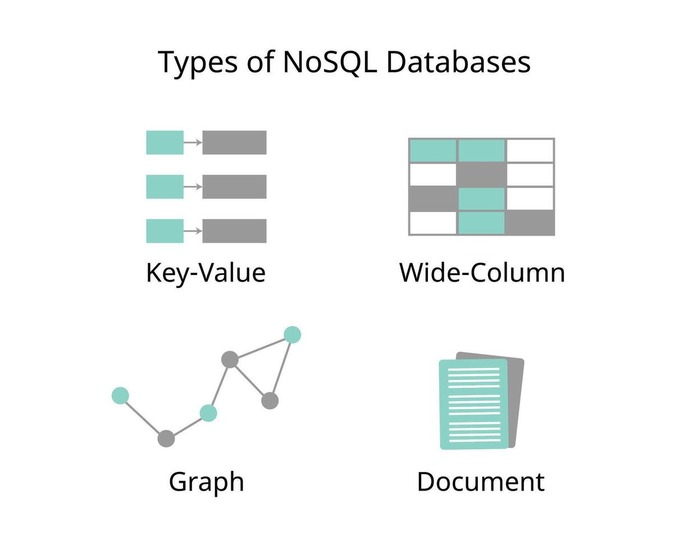

# MongoDB Tutorial

**A separate tutorial for MongoDB using :**
- [Learn MongoDB in 1 hour 🍃](https://www.youtube.com/watch?v=c2M-rlkkT5o&t=105s)

---

## SQL vs NoSQL


***But, Actually, There are different types of NoSQL databases.***




## What is MongoDB?

+ MongoDB is a `document-oriented`, operational database built from the ground up as an alternative to the relational database for modern applications. 
+ Unlike relational databases, MongoDB allows developers to store rich `JSON-like documents` that map naturally to the `objects` they use in their code:

```python
{
   firstname: "Bob",
   lastname: "Smith",
   email: "bob@smith.com",
   address: {
      street: "100 Main St",
      city: "Anytown",
      state: "MO",
      zip: "11111"
   }
}
```
Which you can retrieve with queries such as:
```python
users.find({address.zip: "11111"})
```
+ Data is stored in `JSON-like documents` but it is technically `BSON`, a binary format that is optimized for the storage and retrieval of MongoDB data.

## Document vs Collection vs Database


+ In MongoDB, a document is a set of key-value pairs representing a single entity (object).

+ A collection is a group of documents that share a common schema.

+ A database is a collection of collections.


## Installation

> I installed it using the docker compose file `docker-compose.yml`, which is a file that contains the configuration for a MongoDB container.
```bash
services:
  mongodb:
    image: mongo:7.0.28-jammy
    container_name: mongodb
    ports:
      - "27007:27017"
    volumes:
      - ./mongodb:/data/db
    networks:
      - backend
    restart: always
```

* Just run `docker compose up -d` to start the container.

* To stop the container, run `docker compose down`


> Also, we will use `MongoDB Extension for VSCode` to connect to MongoDB in Visual Studio Code.

* To open `mongosh` (MongoDB Shell) in the container, run `docker exec -it mongodb mongosh`


## MongoDB Shell

| Command | Description |
| --- | --- |
| `show dbs` | List all databases |
| `use <db_name>` | Switch to a database or create a new one if it doesn't exist |
| `db.dropDatabase()` | Delete a database |  
| `db.createCollection(<collection_name>)` | Create a new collection |
| `show collections` | List all collections |
| `db.<collection_name>.find()` | List all documents in a collection | 
| `db.<collection_name>.insertMany(<documents>)` | Insert multiple documents into a collection |
| `db.<collection_name>.findOne(<filter>)` | Find a single document in a collection |
| `db.<collection_name>.find().sort(<sort>)` | Sort documents in a collection |
| `db.<collection_name>.find().limit(<limit>)` | Limit the number of documents returned |
| `db.<collection_name>.find({<filter>})` | Filter documents in a collection |
| `db.<collection_name>.updateOne(<filter>, <update>)` | Update a single document in a collection |
| `db.<collection_name>.updateMany(<filter>, <update>)` | Update multiple documents in a collection |


## Examples

**1- Create a new database named `school`:**

```bash
use school
```

**2- Create a new collection named `students`**:

```bash
db.createCollection("students")
``` 

**3- Insert a new document into the `students` collection:**

```bash
db.students.insertOne({
  "name": "Anas Ahmad",
  "age": 20,
  "grade": "A"
})
```
***Or***
```bash
db.students.insertOne({
  name: "Adam Ahmad",
  age: 20,
  grade: "A"
})
```
> ***No need for quotes for fields like `name`, `age` and `grade`.***


**4- List all documents in the `students` collection:**

```bash
db.students.find()
```


**5- Insert multiple documents into the `students` collection:**

```bash
db.students.insertMany([
  {
    "name": "Omar Ahmad",
    "age": 25,
    "grade": "B"
  },
  {
    "name": "Hamza Ahmad",
    "age": 22,
    "grade": "C"
  },
  {
    "name": "Maryam Ahmad",
    "age": 21,
    "grade": "D"
  }
])
```


**6- We can insert different types of documents:**

```bash
db.students.insertOne(
  {
    name: "Omar Ahmad",
    fullTime: true,
    skills: ["HTML", "CSS", "JavaScript"]
  })
```
> ***No Limitations on the number of fields. or the type of the fields.***


**7- Date Fields:**

```bash
db.students.insertOne({
  name: "Omar Ahmad",
  fullTime: true,
  skills: ["HTML", "CSS", "JavaScript"],
  createdAt: new Date()
})
```

> ``new Date()`` is a function that returns the current date and time in UTC.
and you can pass a date and time to it like this: ``new Date("2023-01-01 00:00:00")``

**8- Null Values:**

```bash
db.students.insertOne({
  name: "Omar Ahmad",
  fullTime: true,
  skills: ["HTML", "CSS", "JavaScript"],
  graduation: null
})
```

**9- Nested Documents:**

```bash
db.students.insertOne({
  name: "Omar Ahmad",
  fullTime: true,
  skills: ["HTML", "CSS", "JavaScript"],
  address: {
    street: "123 Main St",
    city: "New York",
    state: "NY",
    zip: "10001"
  }
})
```

**10- Sorting and Limiting:**

```bash
db.students.find().sort({age: -1}).limit(2)
```

> ``1`` means ascending order, ``-1`` means descending order

> ``limit`` means the number of documents to return 


**11- Filtering (Query):**

```bash
db.students.find({age: {$gt: 25}})
```

> ``$gt`` means greater than

> ``$lt`` means less than

> ``$gte`` means greater than or equal to

> ``$lte`` means less than or equal to

> ``$ne`` means not equal to

> ``$in`` means in

> ``$nin`` means not in


**12- Selecting Fields:**

```bash
db.students.find().projection({name: 1, age: 1})
```

***Or***

```bash
db.students.find({}, {name: 1, age: 1})
```

> ``1`` or ``true`` means include, ``0`` or ``false`` means exclude

***Query and projection can be used together***

```bash
db.students.find({age: {$gt: 25}}, {name: 1, age: 1})
```

```bash
db.students.find({}, {_id: false, name: true, age: true}).limit(2)
```

> Query maps to `WHERE` and projection maps to `SELECT` in SQL